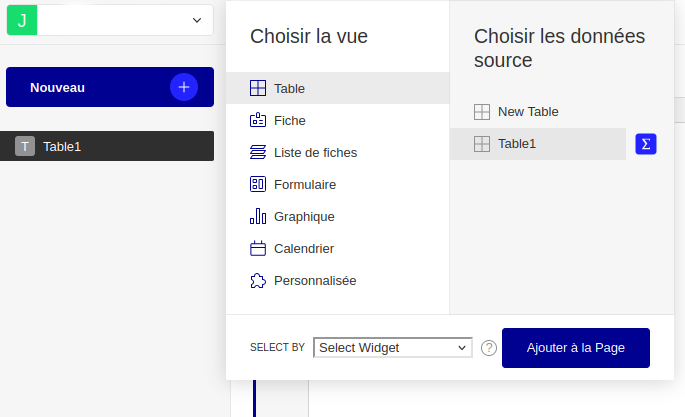
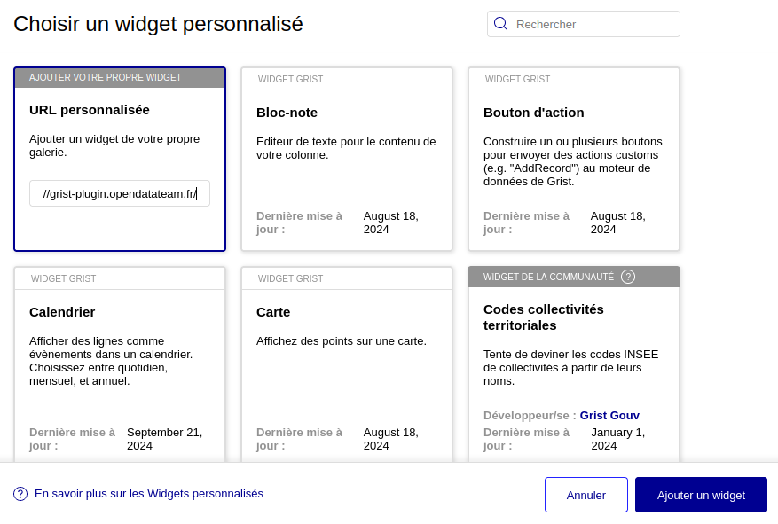
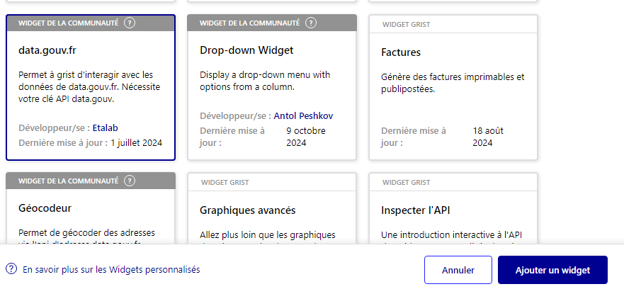
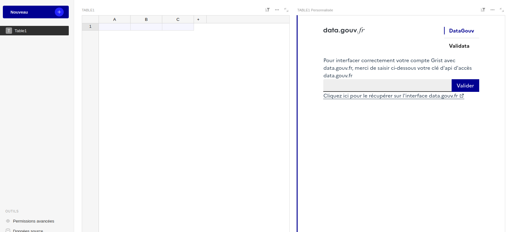
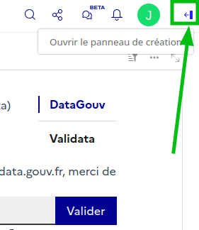
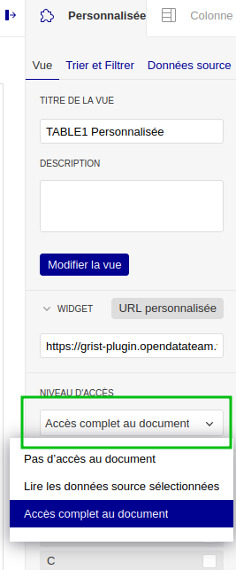
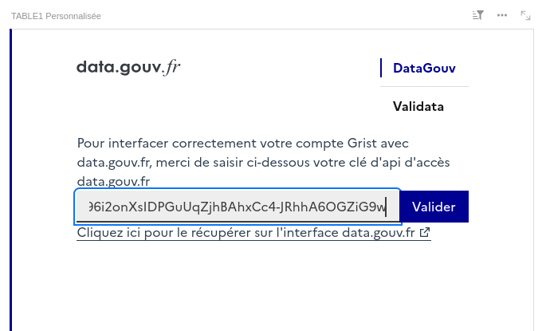
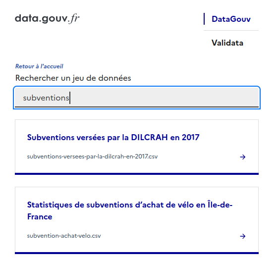
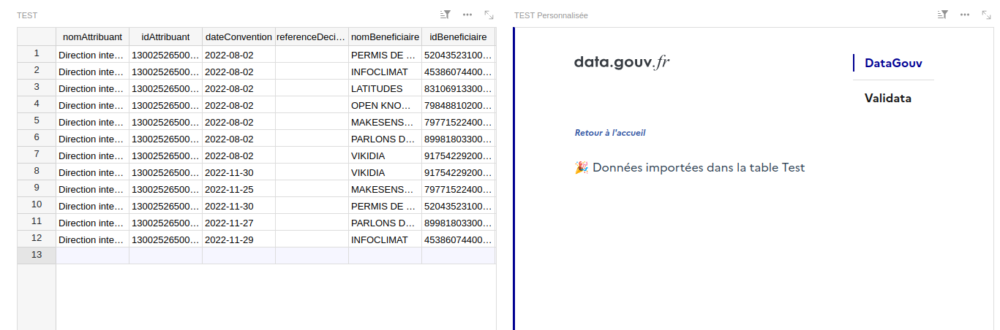

# Guides d'utilisation du plugin Grist data.gouv.fr - Onglet DataGouv

[Voir les prérequis](./README.md).

Sommaire :

* [Ajouter le plugin](#ajouter-le-plugin)
* [Donner au plugin l'accès au document](#donner-au-plugin-laccès-au-document)
* [Donner au plugin l'accès à data.gouv.fr](#donner-au-plugin-laccès-à-datagouvfr)
* [Récupérer des données data.gouv.fr](#récupérer-des-données-datagouvfr)

## Ajouter le plugin

1. Depuis la page d'accueil de Grist, ouvrir un document existant ou en créer un nouveau en cliquant sur "Document vide"
2. Dans le document, choisir dans la barre latérale gauche la page qui récupérera les données de [data.gouv.fr](http://data.gouv.fr) (par exemple "Table1" si c'est un nouveau document vide) et cliquer sur "Nouveau", puis "Ajouter une vue à la page"
3. Sélectionner "Personnalisée" et choisir votre page (par exemple "Table1")
4. Cliquez sur "Ajouter à la page"

5. Dans la fenêtre "Choisir un widget personnalisé" qui vient de s'ouvrir, cliquer sur "Ajouter votre propre widget - URL personnalisée" et coller l'URL du plugin :  

> `https://grist-plugin.opendatateam.fr/`  

puis cliquer sur "Ajouter un widget"

ℹ️ Si vous êtes sur l'instance grist.numerique.gouv.fr : rechercher "data.gouv.fr", sélectionner le plugin et cliquer sur "Ajouter un widget"

Le plugin data.gouv.fr (ce que Grist appelle un "widget personnalisé") est maintenant ajouté sur votre page "Table 1" et l'interface du plugin data.gouv.fr occupe la moitié droite de la page.

## Donner au plugin l'accès au document

1. Ouvrir la barre latérale droite ("panneau de création") :

2. Dans l'onglet "Personnalisée" de la barre latérale droite, ouvrir le menu "Niveau d'accès" et sélectionner "Accès complet au document"

## Donner au plugin l'accès à data.gouv.fr

1. Dans l'onglet "DataGouv" du plugin data.gouv.fr, entrer la clé API data.gouv.fr [que vous avez préalablement copiée](README.md) et clique sur "Valider"

## Récupérer des données data.gouv.fr

1. Cliquer sur "Je veux récupérer des données data.gouv.fr"
2. Sélectionner la table que vous voulez utiliser (par exemple "Table1")
3. Sélectionner une organisation dont vous faites parties ou cliquer sur "Récupérer des données qui ne sont pas dans mes organisations"
3. Rechercher un jeu de données et sélectionner un fichier parmi les résultats

⚠️ Les fichiers qui ne sont pas compatibles (au format tabulaire) ne sont pas affichés par le plugin.

Votre fichier est maintenant importé dans la moitié gauche de la page "Table1".

