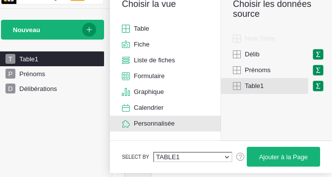
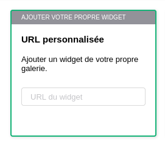
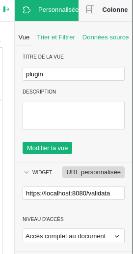
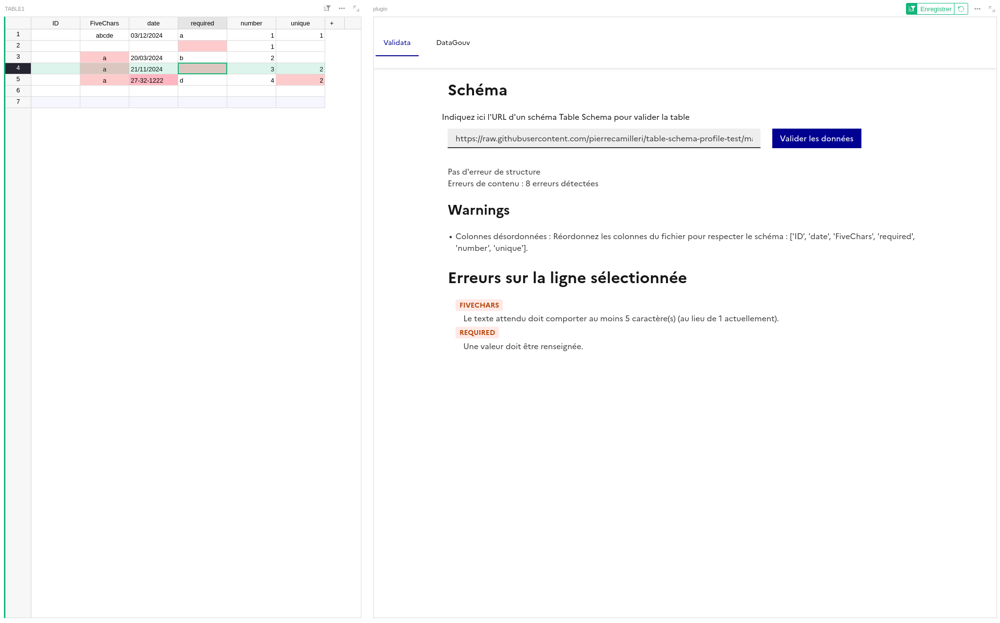

# Guides d'utilisation du plugin Grist data.gouv.fr - Onglet Validata

[Voir les prérequis](./README.md)

- `Nouveau` > `ajouter une vue à la page` > `Personnalisée` >  Choisir la donnée source > Sélectionner la vue dans `SELECT BY` > `Ajouter à la page`

- Entrer l'URL du plugin dans la tuile `Ajouter votre propre widget`, puis 
  appuyer sur `Ajouter un widget`

- Dans le "panneau de création" (à droite), onglet `Personnalisée`, puis 
  `Vue`, dans le menu déroulant de la section `NIVEAU D'ACCÈS`, sélectionner 
  `Accès complet au document`

- Entrer l'url du schéma au format Table Schema dans le champs texte du 
  plugin.
- Appuyer sur `Valider les données` 
- Pour afficher les informations sur les erreurs dans la table, sélectionner 
  la ligne avec des erreurs. Les erreurs de la ligne s'affichent dans la 
  fenêtre du plugin. 

- La validation est relancée automatiquement à chaque changement dans les 
  données, ou peut être relancée manuellement en appuyant sur `Valider les 
  données`

* URL du plugin : pour l'instant, le plugin n'est pas déployé. Cf `Project 
  setup for developpers` pour faire un déploiement local.

## Limites connues 

- Avec des données privées, le plugin dysfonctionne avec les formats de dates 
  et de nombres.
- Le plugin ne prend pas nécessairement en compte les filtres et l'ordre des 
  colonnes de la vue liée.
- Des erreurs concernant des lignes complètes ne sont pas correctement 
  formattées. 
